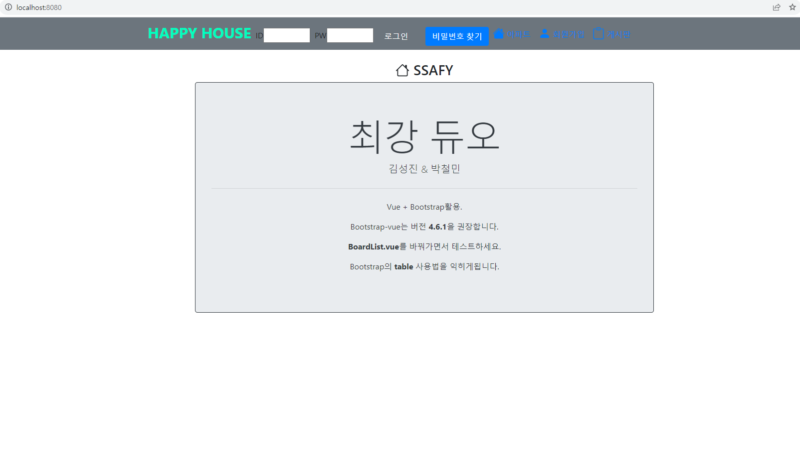
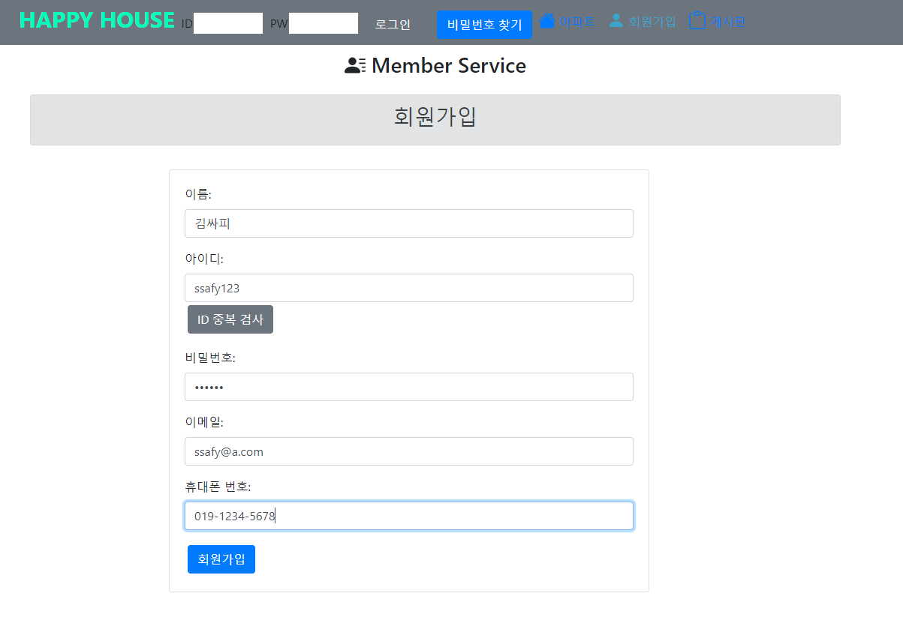
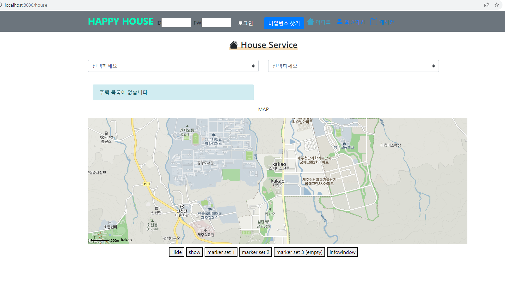
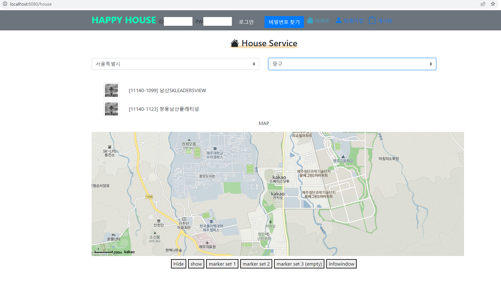
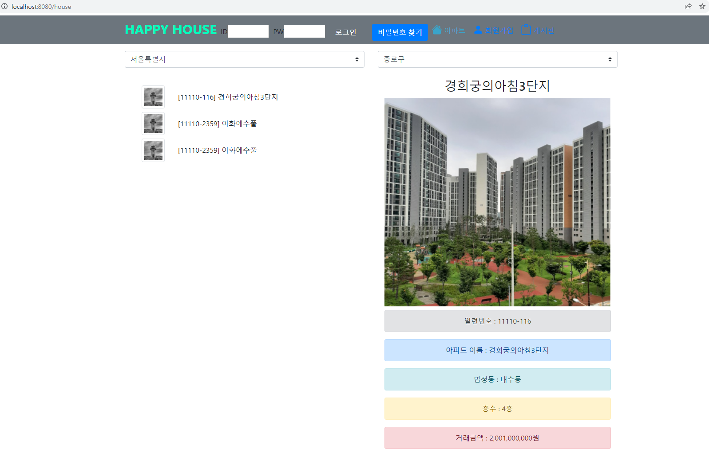
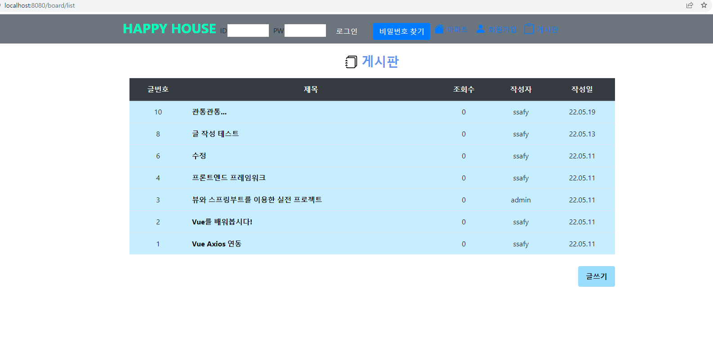
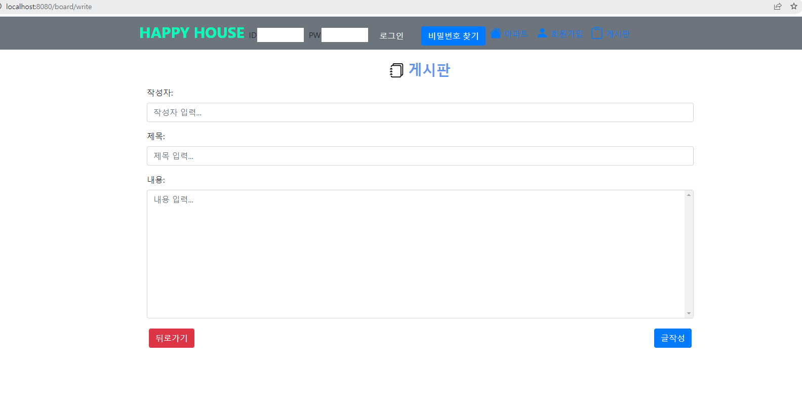
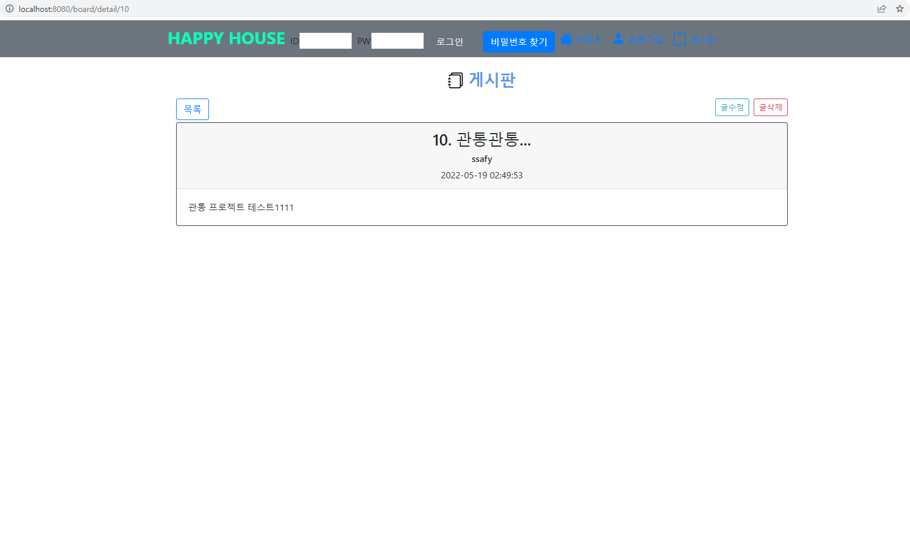

# HappyHouse 관통 프로젝트

## 1. 프로젝트 목표
- 요구사항을 확인하고 기존의 SpringBoot 프로젝트의 프론트엔드 부분을 Vue에 적용시켜 프로젝트를 변경한다.

## 2. 프로젝트 요구사항
- 로그인, 회원가입, 비밀번호 찾기 등의 회원 관리
- 시,구군 별 아파트 목록 표시(+지도에 표시), 아파트 상세 정보
- 게시판 기능 구현(게시물 목록, 게시물 작성, 게시물 보기, 게시물 수정, 게시물 삭제) 

## 3. 프로젝트 결과

#### -메인페이지 

#### -회원가입 

#### -아파트 정보 페이지 

####-시,구군 아파트 거래 목록 

#### -아파트 상세 정보 

#### -게시판 목록 

#### -게시판 작성 

#### -게시물 보기 

